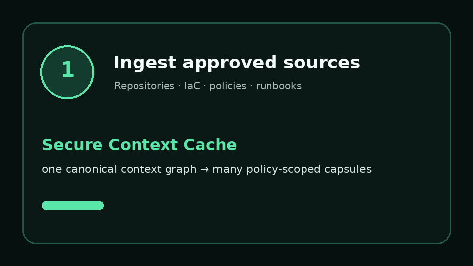

# Secure Context Cache

**Secure token optimization for enterprise AI agents**

**Product website:** https://krishnamuppidi.github.io/secure-context-cache/

**Flagship application:** [SecureReviewAgent](https://github.com/krishnamuppidi/secreviewagent-ai)



Secure Context Cache is a research-backed framework that reduces recurring AI input tokens without
removing the facts an agent needs to succeed. It converts approved enterprise knowledge into
reusable context slices, then assembles the smallest policy-approved capsule for each task before
the model is called.

The result is one optimization layer for both economics and control: fewer tokens sent to the
model, less sensitive context exposed, preserved provenance, and an audit record for every release
or denial. The repository includes the deployable **Agent Context Gateway (ACG)** API and AWS
control plane while preserving the stable `acg` CLI, API, and environment-variable integration
surface.

SecureReviewAgent is the first proof point: it uses a governed context capsule to review Terraform
and Kubernetes changes with relevant IAM, network, policy, ownership, and environment facts while
unrelated enterprise topology remains outside the prompt.

## The Selling Point

**Optimize context before paying a model to process it.**

- **Lower token cost:** reuse approved context slices and send only task-relevant facts.
- **Preserve outcome quality:** count savings only when required facts, task success, and reviewer
  acceptance meet a defined threshold.
- **Reduce exposure:** keep unrelated or disallowed enterprise context outside the model prompt.
- **Prove the decision:** retain source references, hashes, policy version, expiry, selection,
  denial, and token metrics.

In the deterministic research prototype, Secure Context Cache produced **75.3% lower average
context tokens**, **95.8% task success**, **98.6% required-fact coverage**, and **92.3% lower
high-sensitivity slice exposure** across 24 tasks and 32 reusable slices. These are prototype
measurements—not provider-billed production results or universal savings claims. The included
repository fixture separately demonstrates a reproducible 32-to-16-token deterministic estimate.

## One Product, Three Layers

| Layer | Name | Role |
| --- | --- | --- |
| Product and framework | **Secure Context Cache** | Canonical context graph, reusable slices, secure token optimization, expiring capsules, and audit evidence |
| Runtime control plane | **Agent Context Gateway** | API, identity, policy enforcement, AWS runtime, storage, metrics, and agent integration |
| Flagship application | **SecureReviewAgent** | Measurable Infrastructure-as-Code security-review workflow built on governed context |

The paper **“Secure Context Cache: Token-Efficient and Least-Privilege Shared Memory for Enterprise
Developer Agents”** was accepted for presentation and publication at the 2026 5th International
Conference on Engineering and Research Application (ICERA). Final proceedings and indexing remain
separate post-conference evidence.

See [Secure Context Cache Framework](docs/SECURE_CONTEXT_CACHE_FRAMEWORK.md) for the product-family
architecture and research-to-implementation map.

## Documentation and machine-readable discovery

- **Documentation hub:** https://krishnamuppidi.github.io/secure-context-cache/docs/
- **Benchmark method:** https://krishnamuppidi.github.io/secure-context-cache/secure-context-cache-benchmark/
- **Prompt caching vs. context caching:** https://krishnamuppidi.github.io/secure-context-cache/prompt-caching-vs-context-caching/
- **RAG vs. Secure Context Cache:** https://krishnamuppidi.github.io/secure-context-cache/rag-vs-secure-context-cache/
- **MCP context optimization:** https://krishnamuppidi.github.io/secure-context-cache/mcp-context-optimization/
- **LLM discovery index:** https://krishnamuppidi.github.io/secure-context-cache/llms.txt
- **Full machine-readable context:** https://krishnamuppidi.github.io/secure-context-cache/llms-full.txt

The machine-readable files complement the canonical HTML pages, sitemaps, and repository. They are
not ranking guarantees and do not replace normal crawling, useful content, or independent links.

## What You Can Run

- A local Python CLI and FastAPI demo.
- A Dockerized local API.
- A one-command AWS deployment with:
  - API Gateway HTTPS endpoint.
  - Cognito machine-to-machine OAuth authentication.
  - Lambda runtime with an IAM execution role.
  - Private, KMS-encrypted S3 context storage.
  - KMS-encrypted DynamoDB slice, cache, and audit tables.
  - CloudWatch logs.
  - Automated context upload and authenticated smoke test.

AWS access keys are used only by the deployment tools. They are never embedded in the application,
Lambda package, Terraform state, or repository. The running gateway uses an IAM role.

## Architecture

See [Architecture](docs/ARCHITECTURE.md) for the deployable control plane's data objects, trust
boundaries, cache behavior, and current runtime limits.

```text
Local Repo/Docs/IaC --deploy or upload--> Private S3 context prefix
                                                |
                                                v
Agent Client -> Cognito token -> API Gateway HTTPS -> Lambda gateway
                                                      |       |
                                                      |       +-> DynamoDB audit
                                                      +-> DynamoDB slices/cache
```

The gateway currently ingests `.tf`, `.tfvars`, `.yaml`, `.yml`, `.json`, `.md`, `.py`, and `.go`
files. It derives context slices, applies sensitivity and task policy, and returns a time-limited
context capsule plus token metrics. Read [Context Sources](docs/CONTEXT_SOURCES.md) before uploading
company material.

## Deploy to AWS

Prerequisites: Python 3.11+, AWS CLI, Terraform 1.5+, `curl`, `openssl`, `zip`, and Bash on Linux,
macOS, or WSL.

### 1. Clone

```bash
git clone https://github.com/krishnamuppidi/secure-context-cache.git
cd secure-context-cache
```

### 2. Supply AWS credentials

Use an AWS CLI profile:

```bash
export AWS_PROFILE=my-profile
export AWS_REGION=us-east-1
```

Or temporary environment credentials:

```bash
export AWS_ACCESS_KEY_ID='...'
export AWS_SECRET_ACCESS_KEY='...'
export AWS_SESSION_TOKEN='...'   # when using temporary credentials
export AWS_REGION=us-east-1
```

For an evaluation deployment, the credentials must be allowed to manage Lambda, API Gateway,
Cognito, S3, DynamoDB, KMS, IAM roles/policies, and CloudWatch Logs. Prefer a short-lived role or
temporary credentials. Do not send keys by email or commit them to a file.

Optional account guard:

```bash
export EXPECTED_AWS_ACCOUNT_ID=123456789012
```

### 3. Deploy

The default command uploads the included sample context and performs a live authenticated request:

```bash
./deploy/aws/deploy.sh --auto-approve
```

To deploy with a real local repository or documentation directory:

```bash
export ACG_CONTEXT_DIR=/absolute/path/to/company-repo
export ACG_CONTEXT_ID=payments-platform
./deploy/aws/deploy.sh --auto-approve
```

Optional policy and identity limits:

```bash
export ACG_POLICY_FILE=/absolute/path/to/policy.json
export ACG_ALLOWED_TASK_TYPES=code_review,iac_security,architecture_qa
export ACG_MAX_SENSITIVITY=high
```

The script:

1. verifies the active AWS account;
2. builds an isolated Lambda ZIP;
3. validates and applies Terraform;
4. uploads the selected context to encrypted S3;
5. waits for `/health`;
6. obtains a Cognito client-credentials token;
7. calls `/v1/capsules` and verifies the response; and
8. saves client settings to `deploy/aws/.acg-deployment.env` with mode `600`.

That generated file contains a Cognito client secret. It is ignored by Git and must be handled as a
secret.

### 4. Use the deployed gateway

Invoke the default task:

```bash
./deploy/aws/invoke.sh
```

Pass a task type, context-relative path, prompt, and context ID:

```bash
./deploy/aws/invoke.sh \
  iac_security \
  terraform/prod/payments/lambda.tf \
  "Review this change for security and blast-radius risk" \
  payments-platform
```

Upload or replace another context source without redeploying:

```bash
./deploy/aws/upload-context.sh /absolute/path/to/another-repo another-context
```

Get a fresh OAuth access token for integration with another agent:

```bash
token=$(./deploy/aws/get-token.sh)
```

See [deploy/aws/README.md](deploy/aws/README.md) for direct API examples and deployment details.
Use the [Operations Runbook](docs/OPERATIONS_RUNBOOK.md) and
[Troubleshooting Guide](docs/TROUBLESHOOTING.md) for ongoing use.

## Local Quick Start

```bash
python -m venv .venv
. .venv/bin/activate
pip install -e ".[dev]"
acg demo --repo examples/sample_repo --out build/demo
```

Generated outputs include the context graph, slices, capsule, insights, audit record, and metrics in
`build/demo/`.

Run tests:

```bash
pytest -q
python -m compileall src tests
```

## Local API and Docker

Configure a non-demo local identity before starting a networked API:

```bash
pip install -e ".[api]"
export ACG_LOCAL_AGENT_ID=local-agent
export ACG_LOCAL_API_KEY="$(openssl rand -hex 32)"
export ACG_LOCAL_ALLOWED_TASK_TYPES=code_review,iac_security,architecture_qa
export ACG_LOCAL_MAX_SENSITIVITY=high
export ACG_ALLOWED_REPO_ROOT="$(pwd)/examples/sample_repo"
uvicorn agent_context_gateway.api:app --reload
```

Then call it with the same key and agent ID:

```bash
curl -sS http://127.0.0.1:8000/v1/capsules \
  -H 'content-type: application/json' \
  -H "x-agent-api-key: $ACG_LOCAL_API_KEY" \
  -d '{
    "task_type": "iac_security",
    "path": "terraform/prod/payments/lambda.tf",
    "prompt": "Review this Terraform change",
    "agent_id": "local-agent",
    "environment": "prod"
  }'
```

Docker:

```bash
docker build -t secure-context-cache .
docker run --rm -p 8080:8080 \
  -e ACG_LOCAL_AGENT_ID=local-agent \
  -e ACG_LOCAL_API_KEY="$ACG_LOCAL_API_KEY" \
  -e ACG_ALLOWED_REPO_ROOT=/app/examples/sample_repo \
  secure-context-cache
```

The public AWS deployment does not use the demo API keys. API Gateway verifies Cognito JWTs before
invoking Lambda, and the gateway maps verified client claims to policy inputs.

## Policy and Audit Behavior

The default policy is in `config/policy.example.json`. AWS packages that file and loads it through
`ACG_POLICY_FILE`. Policy controls task sensitivity, path matching, capsule lifetime, approval-gated
restricted context, and freshness limits.

For each authenticated AWS request, the gateway persists:

- derived context slices;
- selected and denied slice IDs;
- caller/client identity;
- source hashes and freshness metadata;
- capsule hash and policy version;
- cache-hit and token-reduction metrics.

## Production Hardening

The automated deployment is suitable for a controlled evaluation or pilot. Before broad production
use:

- replace the generated shared machine client with one Cognito client per agent/workload;
- set task and sensitivity policy per client or introduce a dedicated policy service;
- enable Cognito deletion protection and remote encrypted Terraform state;
- configure alarms, budgets, WAF/rate limits, and organization log retention;
- add private networking if enterprise policy requires it;
- review repository content before upload and exclude unsupported or sensitive raw files; and
- red-team prompt injection, cross-context access, over-broad release, and approval workflows.

See [SECURITY.md](SECURITY.md) for trust boundaries.

## Documentation

- [Secure Context Cache Framework](docs/SECURE_CONTEXT_CACHE_FRAMEWORK.md)
- [Getting Started](docs/GETTING_STARTED.md)
- [Architecture](docs/ARCHITECTURE.md)
- [Agent Integration](docs/AGENT_INTEGRATION.md)
- [API Reference](docs/API_REFERENCE.md)
- [Policy Guide](docs/POLICY_GUIDE.md)
- [Context Sources](docs/CONTEXT_SOURCES.md)
- [AWS Deployment](deploy/aws/README.md)
- [AWS Deployer IAM](docs/DEPLOYER_IAM.md)
- [Kubernetes Evaluation](docs/KUBERNETES.md)
- [Operations Runbook](docs/OPERATIONS_RUNBOOK.md)
- [Troubleshooting](docs/TROUBLESHOOTING.md)
- [Production Readiness](docs/PRODUCTION_READINESS.md)
- [Client Examples](examples/clients/README.md)
- [Roadmap](ROADMAP.md)
- [Contributing](CONTRIBUTING.md)
- [Support](SUPPORT.md)
- [Citation](CITATION.cff)
- [Changelog](CHANGELOG.md)

## Remove the AWS Deployment

```bash
./deploy/aws/destroy.sh
```

Terraform will show the resources to remove and request confirmation. The S3 bucket is configured
for evaluation teardown and its uploaded objects are removed with the stack.

## License

MIT. See [LICENSE](LICENSE).

## Disclaimer

The views and opinions expressed in this repository are solely those of the author and do not
represent or reflect the views, positions, policies, or opinions of the author's employer or any
affiliated organization. The content is provided for informational purposes only.
